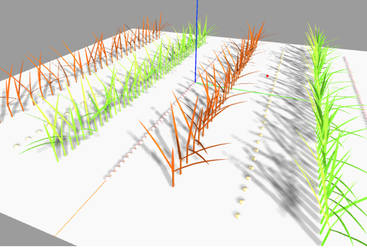

.. _plantfusion:

.. module:: plantfusion

Welcome to PlantFusion's documentation!
============================================

Module description
********************

.. sidebar:: Summary

    :Version: |version|
    :Date: |today|
    :Author: See `Authors`_ section
    
.. topic:: Overview

      This package provides an API for modelling mixing crops involving several functional-structural plant models (FSPM). Its aim is to simplify the building of such simulations. 
      It takes place through the [MobiDiv](https://www6.inrae.fr/mobidiv/) research project, especially in the modelling of mixed crops with wheat and alfafa. 

      Currently, this API recognizes two FSPM, [CN-Wheat](https://github.com/openalea-incubator/WheatFspm) and [l-egume](https://github.com/glouarn/l-egume).
    

Documentation
**************

.. toctree::
    :maxdepth: 2
    :caption: User Guide

    installation
    tutorials

.. toctree::
    :maxdepth: 2
    :caption: Reference Guide

    reference

Contact
**************

For any question, please submit to https://github.com/openalea-incubator/plantfusion/issues.

Authors
**************

- Maurane Woussen
- Romain Barillot
- Didier Combes
- Gaëtan Louarn

License
**************
|plantfusion| is released under CeCILL-C License. See file :download:`LICENSE <../LICENSE>` for details.

Funding
**************

Research references
*******************

Indices and tables
*******************

* :ref:`genindex`
* :ref:`modindex`
* :ref:`search`

.. |plantfusion| replace:: :mod:`plantfusion`